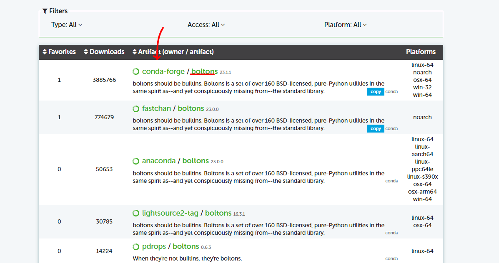
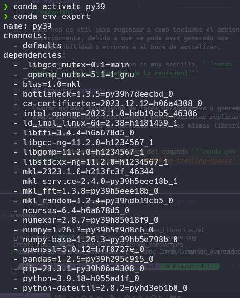
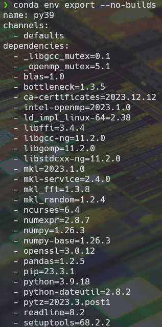
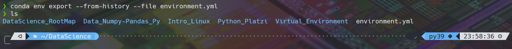
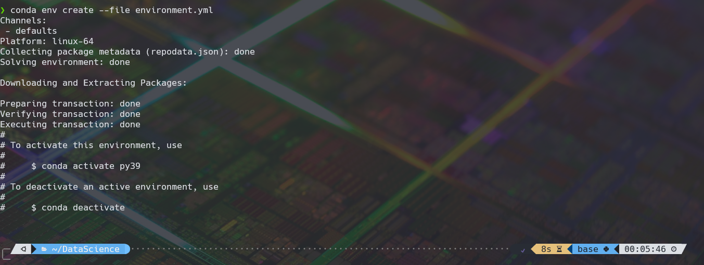

# Conda: Comandos Avanzados 🔥

Ya hemos visto como crear ambientes virtuales y como eliminar librerías y ambientes que ya no nos son útiles.

> Una buena practica a la hora de practicar con los ambientes virtuales es hacerlo en un propio ambiente virtual y dejar el base sin cambios.

En el caso de que en nuestro dia a dia como científico de datos necesitamos instalar una librería que no se encuentra en conda la pregunta es que podemos hacer?

Lo primero que tendríamos que hacer es ir a la pagina de conda [Click aquí para ir](https://anaconda.org/) y buscaremos el paquete que queremos instalar.

Si se encuentra en la paquetería lo podemos instalar de la siguiente manera.

```conda
conda install --channel [nombre del canal] [nombre del paquete]
```




Para este caso queremos instalar el paquete boltons, una ves buscado en anaconda tenemos que la manera de instalarlo es a traves de conda-forge que viene siendo nuestro canal y boltons es la libreria que queremos.

## Revisiones

Cuando actualizamos nuestro ambiente virtual se crea una pequeña copia o revision que nos permite ver todo lo que hemos instalado y actualizado a traves del tiempo. (un commit de git) para ver las revisiones que se han creado en el ambiente virtual tenemos que teclear ```conda list --revision```

Esto nos es util para regresar a como teníamos el ambiente anteriormente, debido a que se pudo aver generado una incompatibilidad o errores a al hora de actualizar.

para regresar a una revision es muy sencillo, ```conda install --revision [nombre de la revision]```

## Exportar ambientes

Cuando estamos trabajando de forma colaborativa o queremos compartir nuestros resultados y poder facilitar replicar nuestros resultados se necesita tener las mismas librerías instaladas.

Esto lo podemos hacer a traves del comando ```conda env export``` este nos imprimirá todas las librerías que tenemos instaladas.



Pero compartirlo de esta manera dificulta mucho el poder replicar el ambiente asi que para ello tenemos los siguientes opciones.

```conda env export --no-builds```



Que como podemos ver, pasa las dependencias de manera mas limpia para saber que versiones de cada librería tenemos instalado.

```conda env export --from-history```

Esta exportación nos muestra solo las librerías que nosotros hallamos introducido de manera manual.


Ahora ya teniendo varias versiones que podemos exportar nuestro ambiente de trabajo es hora de pasarlo a un archivo que los demás puedan hacer uso de el.

```conda env export --from-history --file environment.yml```

Como podemos ver la diferencia radica en la opción --file que después tiene el nombre del archivo en y la terminación .yml



## Importar ambientes

Ahora estamos del otro lado, ya no queremos exportar el ambiente de trabajo si no consumir el archivo de environment, como podemos hacerlo?

para eso tenemos que usar el comando ```conda env create --file environment.yml``` y automáticamente empezara a formar el ambiente de trabajo.


