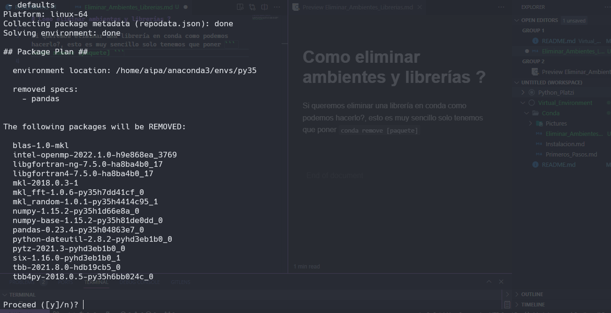
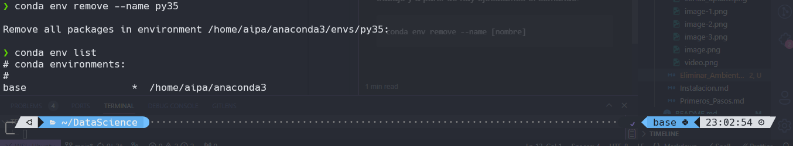

# Como eliminar ambientes y librerías ?

Si queremos eliminar una librería en conda como podemos hacerlo?, esto es muy sencillo solo tenemos que poner ``` conda remove [paquete] ``` donde después te pedirá la confirmación de si quieres eliminar ese paquete o librería.



y para poder eliminar un ambiente de trabajo lo primero que tenemos que hacer es estar en otro ambiente de trabajo y a partir de hay ejecutamos el comando.

```conda
conda env remove --name [nombre]
```


