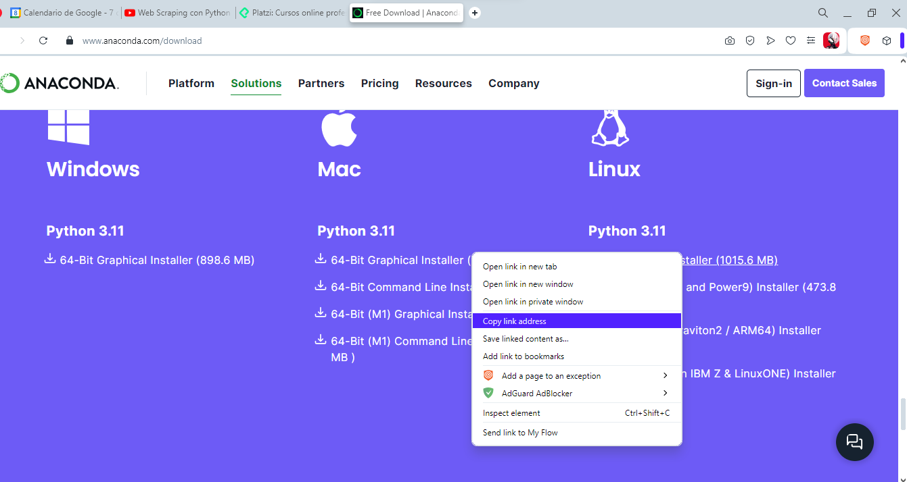
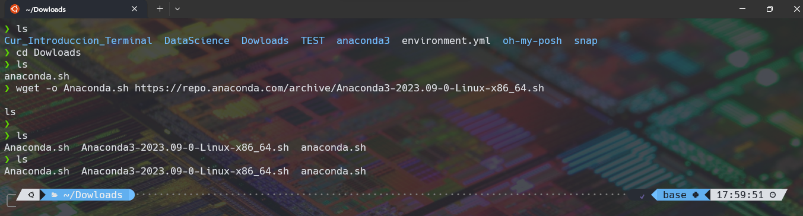
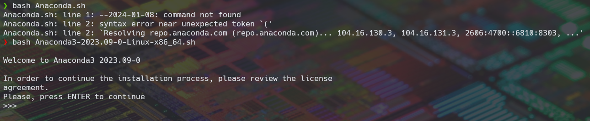
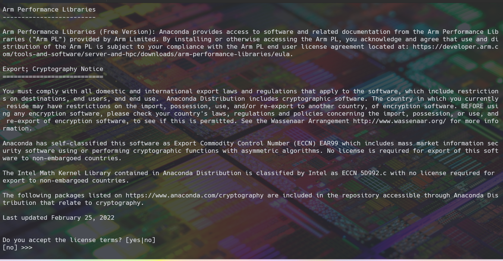
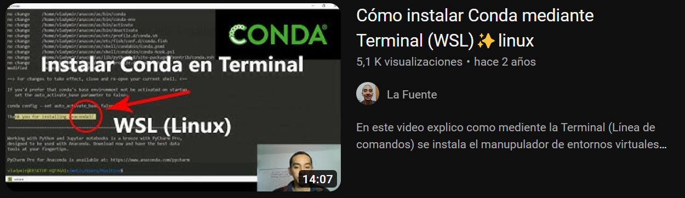

# Instalar Conda desde la Terminal

lo primero es ir a la pagina de [Anaconda](https://www.anaconda.com/download) y irnos hasta la parte de Instalación en este caso escogeremos Linux ya sea de 32 o 64 bits.

Una vez ya identificado la version a instalar le daremos a copiar link de dirección.



Después abriremos la terminal y ejecutaremos el comando ```wget``` para traernos el archivo.

```bash
wget -o Anaconda.sh https://repo.anaconda.com/archive/Anaconda3-2023.09-0-Linux-x86_64.sh
```

y le damos enter , con esto empezaremos a descargar anaconda.


una vez terminado tendremos el archivo llamada anaconda y para proceder con su instalación seria con el siguiente comando.

```bash
bash anaconda.sh
```

y empezara el sistema de descarga.


donde nos aparecerá toda la licencia de conda, tendremos que ir dando enter hasta llegar al mensaje de aceptar los términos de licencia.


y le damos que si y empezara la instalación.

una vez terminado y abriendo una nueva terminal aparecerá un mensaje que dice Py base.

Para actualizar conda seria el siguiente comando.

```bash
conda update conda
```

## Video



[Video de instalación](https://www.youtube.com/watch?v=ONEICFGFXnI)

Créditos a La Fuente, por tener grabado este tutorial :).
