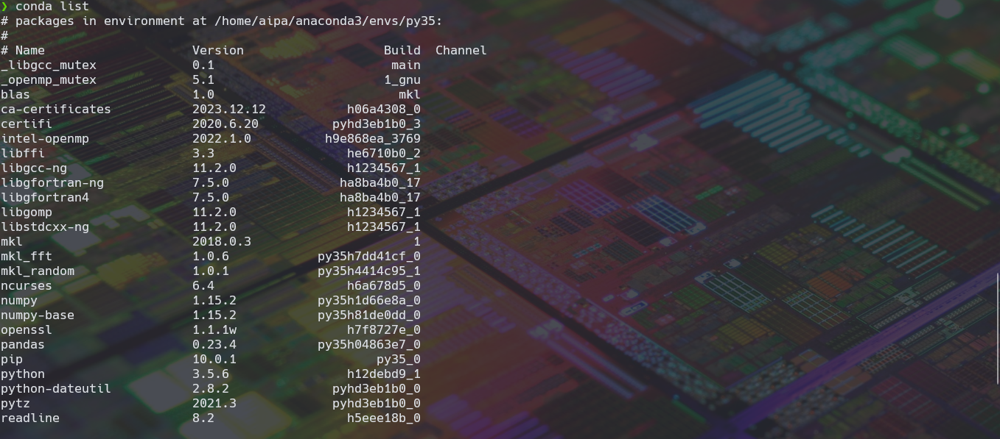
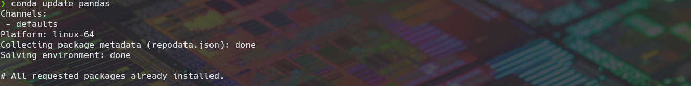
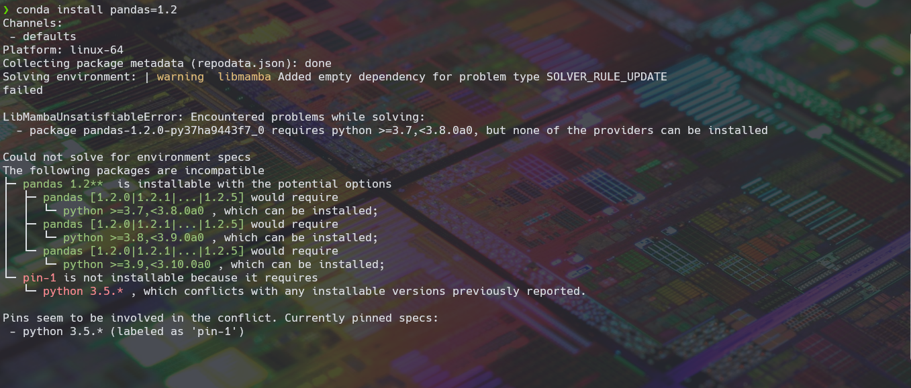

# Nuestros Primeros Pasos 🌱

Para empezar a crear un ambiente virtual una ves ya instalado conda es muy sencillo solo tenemos que ejecutar el siguiente comando.

```conda
conda create --name [nombre] [paquete] = [version]
```


Cuando solo queremos crear solo el ambiente con las librerías actualizadas solamente tenemos que poner ```conda create --name [nombre]```

Una vez creado nuestro ambiente de trabajo podemos ver que paquetes tenemos instalados con ```conda list``` y la version en la que se encuentran instalados.



Si queremos actualizar a la ultima version alguna librería que sea compartible con nuestro ambiente de trabajo se puede hacer usando, ```conda update [paquete]```



Mientras que si necesitamos actualizar un paquete a una version mas actualizado podemos usar el comando ```conda install [paquete] = version``` el cual una ves ejecutado nos dirá que version de otros paquetes o versiones de python, r, etc tenemos que actualizar para poder usar es paquete.



Para este caso quiero actualizar a la version de pandas 1.2 pero como tengo instalado python 3.5, uno de los mensajes me marca que debo tener actualizado python a la version 3.7 o superior, y lo que tengo que hacer es actualizar python para poder actualizar pandas.

para copiar o renombrar ambientes podemos hacer lo siguiente

```conda
create --name [nombre_ambiente] --copy --clone [nombre_ambiente_a_copiar]
```

Esto nos permite copiar el ambiente que ya tenemos y actualizar su nombre para poder seguir utilizándolo.

Para saber la cantidad de ambientes que tenemos creados se usa el comando ```conda env list``` el cual nos arrojara una lista de los ambiente que tenemos.


